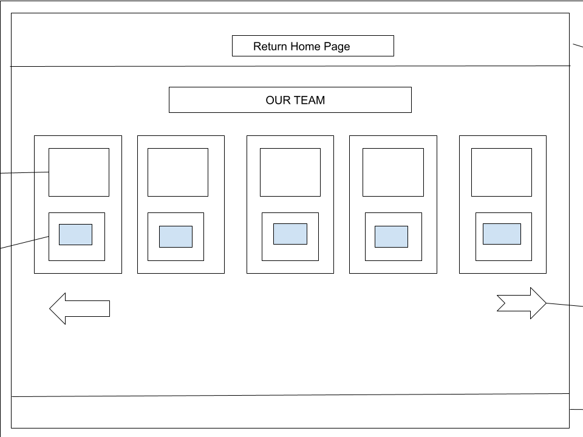
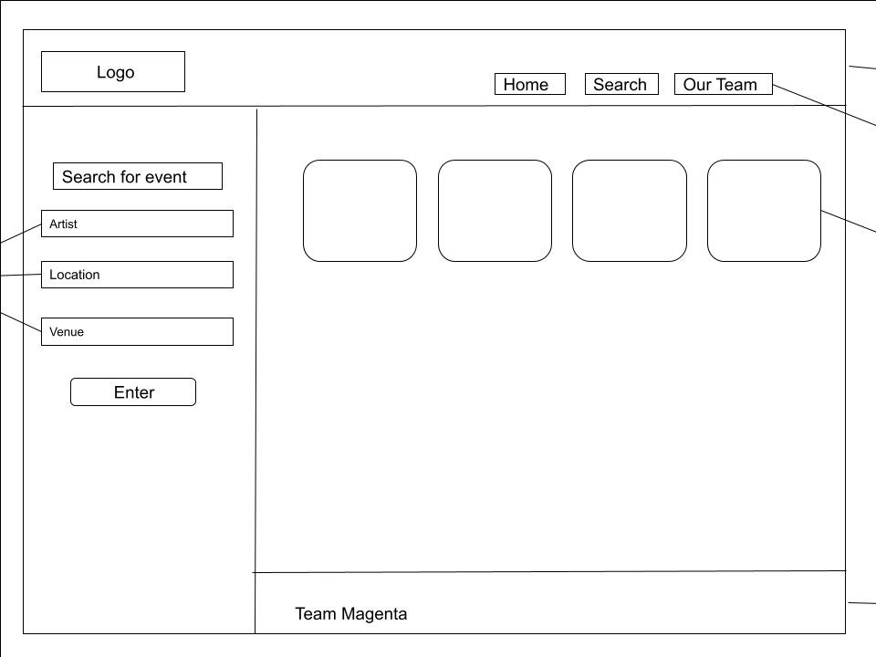
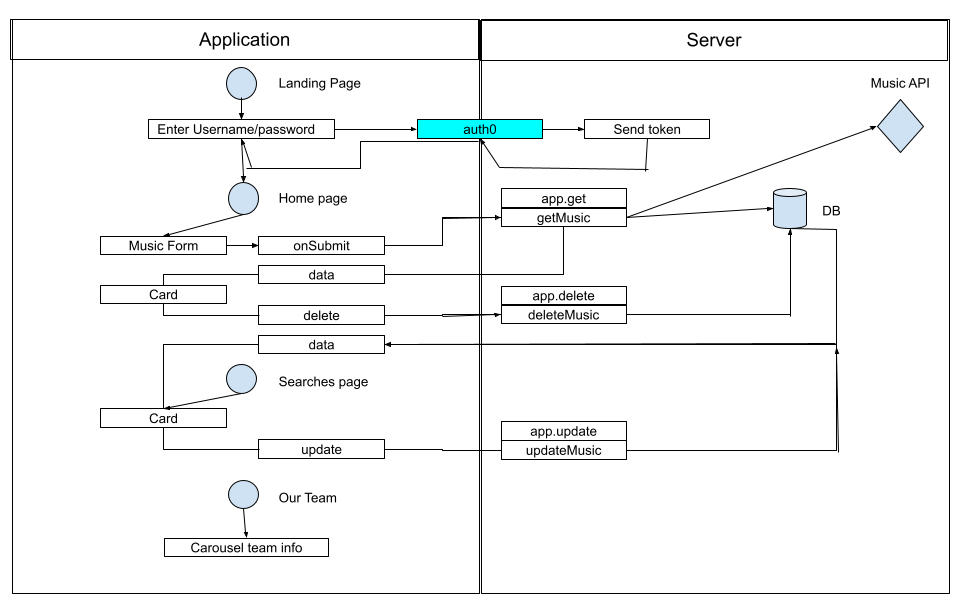
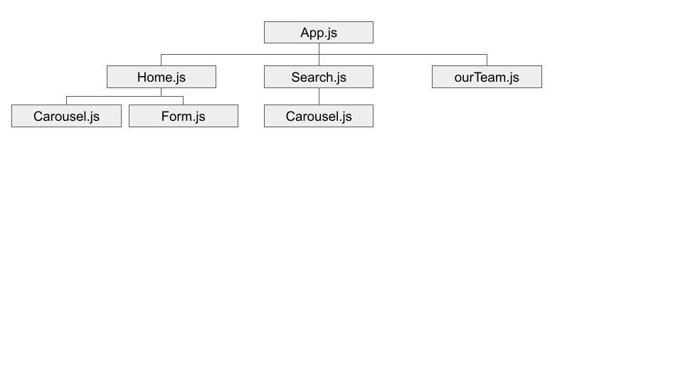
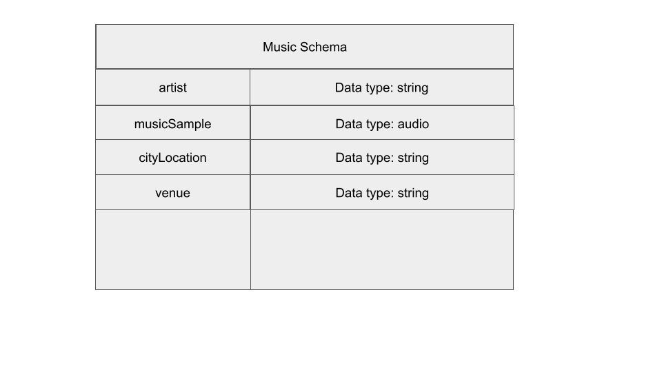

# Music Locator

Music Locator is a web app that provides a convenient way to search for live music events in an area of your choosing.

## Meet the Team

This app was created by:
Dennis DeVries
Falashade Greene
Marvin Bonds
Stephen Martinez
Scottie Houghton

## Wireframe

[Music Locator About Wireframe](https://docs.google.com/drawings/d/1f831-QZ1OVqZ8hTCQo4jJytjDMvlJpRL24Z4SwCBfhQ/edit?usp=sharing)

[Music Locator Home Wireframe](https://docs.google.com/drawings/d/1UuNM-lfzcEMmKFs54IWtDPP0rjOIaWgTS_tbnSTfPfk/edit?usp=sharing)

## Domain Model

[Music Locator Domain Model](https://docs.google.com/drawings/d/1TGs0nMVWqkyOXwKnGifwO6kaoODXemAhEY98pLp-_pM/edit?usp=sharing)

[Music Locator Component Layout](https://docs.google.com/presentation/d/1zJTmIyOjBK-HBRO-Rs7gAqGj2GMmUxyJgzTBV-kG2Bw/edit?usp=sharing)

## Schema

## User Stories

[User Stories Link](https://trello.com/invite/b/lsJ0WQHH/df3b008dcee6807d0d63b2078ac8facf/301d86-final-live-music-locator)
